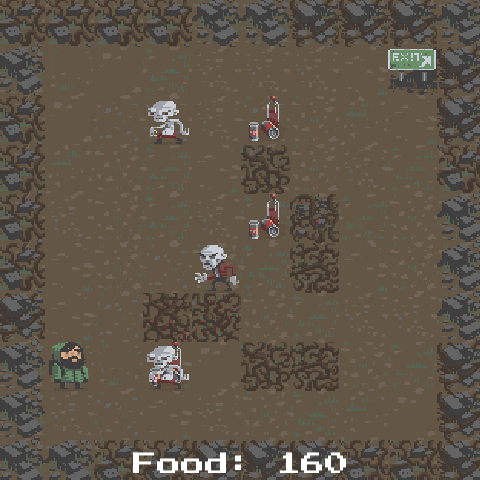

# Entitas 2D Roguelike

This is a rewrite of the [Unity 2D Roguelike Tutorial](https://unity3d.com/learn/tutorials/projects/2d-roguelike-tutorial) using [Entitas](https://github.com/sschmid/Entitas-CSharp).
Entitas is an Entity Component System which allows projects to be architected in a clean and extendable manner.

## License

This project is licensed under the [MIT license](http://opensource.org/licenses/MIT).
It uses assets from the orignal tutorial project which is owned by Unity Technologies.
Use of these assets is granted in the [Unity FAQ](http://unity3d.com/unity/faq):

> all assets in our tutorial and example projects may be used in both commercial
and non-commercial use in Unity-based projects. The assets themselves may not be resold, however.

Full details can be found in the [LICENSE](license) file.